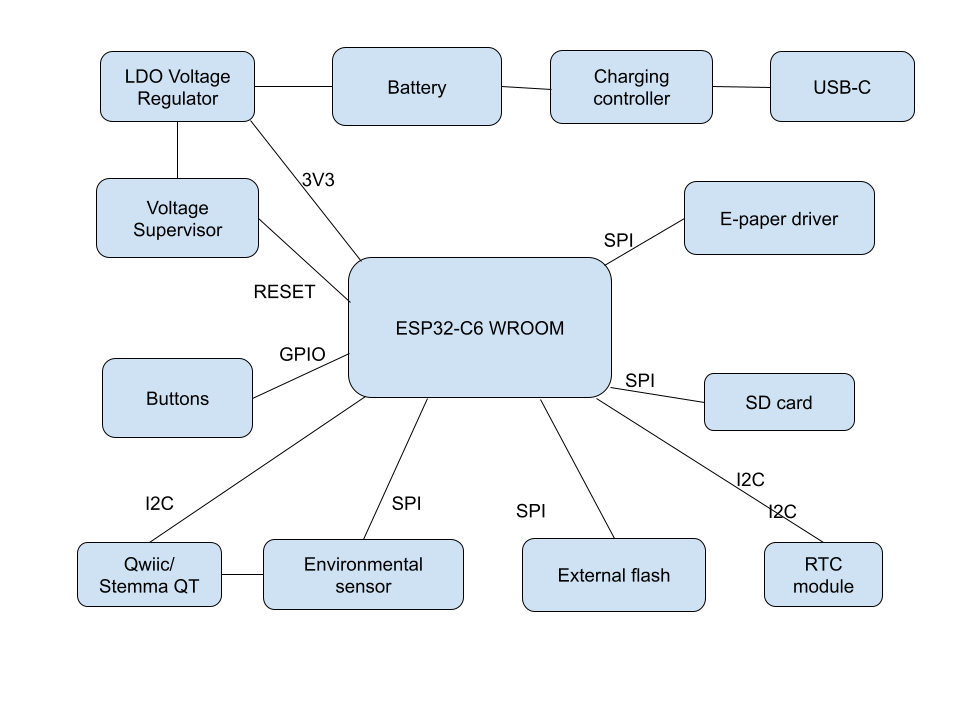

# OpenBook &copy; Matei-Bogdan Plescan 2025

## Diagrama bloc

## Bill of Materials

| Piesă                                      | Qty                                                                                             | Datasheet | Aprovizionare  |
|----------------------------------------------|---------------------------------------------------------------------------------------------------|----------------|-----------------|
| ADAFRUIT_CHIP-LED0603                        | 1                                                                                           | [Link](https://www.snapeda.com/parts/KP-1608SURCK/Kingbright/datasheet/)      | [Link](https://www.arrow.com/en/products/kp-1608surck/kingbright?utm_campaign=arrow_snapeda_q32020&utm_currency=USD&utm_term=KP-1608SURCK&utm_content=inpart_link_download&region=europe&utm_source=snapeda&utm_medium=aggregator)       |
| SJ                                           | 1                                                                                               | [Link](https://grabcad.com/library/solder-jumpers-1)      | [Link](https://grabcad.com/library/solder-jumpers-1)       |
| ESP32_WROVER_EAGLE-LTSPICE_R0402             | 24                                                                                       | [Link](https://ro.mouser.com/ProductDetail/YAGEO/RC0402FR-07100KL?qs=mnq%2FyloZIXzTlUn7JAHSWg%3D%3D)      | [Link](https://ro.mouser.com/ProductDetail/YAGEO/RC0402FR-07100KL?qs=mnq%2FyloZIXzTlUn7JAHSWg%3D%3D)       |
| ESP32_WROVER_EAGLE-LTSPICE_C0402             | 26                                                           | [Link](https://eu.mouser.com/datasheet/2/447/upy_gphc_x5r_4v_to_50v-3461255.pdf)      | [Link](https://eu.mouser.com/ProductDetail/YAGEO/CC0402MRX5R5BB106?qs=zEY9bCHj09eCmUJdZuS5Lg%3D%3D)       |
| RCL_CT3528                                   | 1                                                                                                 | [Link](https://ro.mouser.com/ProductDetail/KEMET/T491B107M006AT?qs=U312oeP%2FpiHOgyk6KO2m0g%3D%3D)      | [Link](https://ro.mouser.com/ProductDetail/KEMET/T491B107M006AT?qs=U312oeP%2FpiHOgyk6KO2m0g%3D%3D)       |
| 112ATAARR03ATTEND                            | 1                                                                                                 | [Link](https://store.comet.bg/download-file.php?id=27596)      | [Link](https://store.comet.srl.ro/Catalogue/Product/43497/)       |
| ESP32_WROVER_SPARKFUN-DISCRETESEMI_SOT23-3    | 2                                                                                             | [Link](https://www.diodes.com/assets/Datasheets/DMG2305UX.pdf)      | [Link](https://eu.mouser.com/ProductDetail/Diodes-Incorporated/DMG2305UX-7?qs=L1DZKBg7t5F%2FNBHrjfxC%252Bg%3D%3D)       |
| IND_4828-WE-TPC_WRE                         | 1                                                                                                 | [Link](https://www.we-online.com/components/products/datasheet/744043680.pdf)      | [Link](https://eu.mouser.com/ProductDetail/Wurth-Elektronik/744043680?qs=PGXP4M47uW6VkZq%252BkzjrHA%3D%3D)       |
| SOT95P280X125-5N                             | 1                                                                                                | [Link](https://fscdn.rohm.com/en/products/databook/datasheet/ic/power/voltage_detector/bd52xxg-e.pdf)      | [Link](https://eu.mouser.com/ProductDetail/ROHM-Semiconductor/BD5229G-TR?qs=4kLU8WoGk0vvnhrrYwdszw%3D%3D)       |
| MYBUTTON                                     | 2                                                         | [Link](https://www3.panasonic.biz/ac/e_download/control/switch/light-touch/catalog/sw_lt_eng_3529s_side.pdf?f_cd=402906)      | [Link](https://eu.mouser.com/ProductDetail/Panasonic/EVQ-P7L01P?qs=rJ%252BziJWpyszWhhNszc02jQ%3D%3D)       |
| CAPCP3225X100N                               | 1                                                                                        | [Link](https://eu.mouser.com/datasheet/2/360/Seiko_Instruments_MicroBattery_E_20230330_2024Jan_-3561061.pdf)      | [Link](https://eu.mouser.com/ProductDetail/Seiko-Semiconductors/CPH3225A?qs=3etwrb1wR%252BhUOph6lAO7eg%3D%3D)       |
| SOIC127P1032X265-16N                         | 1                                                                                                 | [Link](https://eu.mouser.com/datasheet/2/609/DS3231-3421123.pdf)      | [Link](https://eu.mouser.com/ProductDetail/Analog-Devices-Maxim-Integrated/DS3231SN?qs=1eQvB6Dk1vhUlr8%2FOrV0Fw%3D%3D)       |
| XCVR_ESP32-C6-WROOM-1-N8                    | 1                                                                                                 | [Link](https://eu.mouser.com/datasheet/2/891/Espressif_ESP32_C6_WROOM_1__Datasheet_V0_1_PRELIMI-3239987.pdf)      | [Link](https://eu.mouser.com/ProductDetail/Espressif-Systems/ESP32-C6-WROOM-1-N8?qs=8Wlm6%252BaMh8ST02Gmwp74cw%3D%3D)       |
| ESP32C6_VARISTOR_CT/CN1812                  | 1                                                                                        | [Link](https://www.digikey.ro/en/products/detail/abracon-llc/AMCV-1812H-180-T/4245629)      | [Link](https://www.digikey.ro/en/products/detail/abracon-llc/AMCV-1812H-180-T/4245629)       |
| ESP32_WROVER_AVX---SD0805S020S1R0_AVX_SD0805S020S1R0_0 | 2                                                                                             | [Link](https://eu.mouser.com/datasheet/2/40/schottky-3165252.pdf)      | [Link](https://eu.mouser.com/ProductDetail/KYOCERA-AVX/SD0805S020S1R0?qs=jCA%252BPfw4LHbpkAoSnwrdjw%3D%3D)       |
| ESP32_WROVER_BME680_PSON80P300X300X100-8N    | 1                                                                                           | [Link](https://www.bosch-sensortec.com/media/boschsensortec/downloads/datasheets/bst-bme680-ds001.pdf)      | [Link](https://store.comet.srl.ro/Catalogue/Product/50164/)       |
| ESP32_WROVER_SPARKFUN-IC-POWER_SOT23-5       | 1                                                                                                 | [Link](https://eu.mouser.com/datasheet/2/268/MCP73831_Family_Data_Sheet_DS20001984H-3441711.pdf)      | [Link](https://eu.mouser.com/ProductDetail/Microchip-Technology/MCP73831T-4ADI-OT?qs=hH%252BOa0VZEiBTiqxSV9eepQ%3D%3D)       |
| FH34SRJ24S05SH99                             | 1                                                                                                 | [Link](https://eu.mouser.com/datasheet/2/760/xc6220-3371556.pdf)      | [Link](https://eu.mouser.com/ProductDetail/Torex-Semiconductor/XC6220A331MR-G?qs=AsjdqWjXhJ8ZSWznL1J0gg%3D%3D)       |
| SON50P200X200X80-9N                          | 1                                                                                                 | [Link](https://eu.mouser.com/datasheet/2/609/MAX17048_MAX17049-3469099.pdf)      | [Link](https://eu.mouser.com/ProductDetail/Analog-Devices-Maxim-Integrated/MAX17048G%2bT10?qs=D7PJwyCwLAoGnnn8jEPRBQ%3D%3D)       |
| SOD3716X135N                                 | 3                                                                                         | [Link](https://eu.mouser.com/datasheet/2/40/schottky-3165252.pdf)      | [Link](https://eu.mouser.com/ProductDetail/KYOCERA-AVX/SD0805S020S1R0?qs=jCA%252BPfw4LHbpkAoSnwrdjw%3D%3D)       |
| DIOC1608X36N                                 | 6                                                                           | [Link](https://www.littelfuse.com/assetdocs/pulseguard-esd-suppressors-pgb1-datasheet?assetguid=8a337998-d54d-466b-be4e-dc5bcd1f9321)      | [Link](https://eu.mouser.com/ProductDetail/Littelfuse/PGB1010603MR?qs=gu7KAQ731URLg4GSnNNN7Q%3D%3D)       |
| JST04_1MM_RA                                 | 1                                                                                                 | [Link](https://eu.mouser.com/datasheet/2/813/Qwiic_Connector_Datasheet-1223982.pdf)      | [Link](https://eu.mouser.com/ProductDetail/SparkFun/PRT-14417?qs=wd5RIQLrsJhgdz%2FpmZ%2F3GQ%3D%3D)       |
| SAMACSYS_PARTS_USB4110GFA                    | 1                                                                                                 | [Link](https://eu.mouser.com/datasheet/2/837/GCT_USB4110_Product_Drawing___20k_cycles-3455479.pdf)      | [Link](https://eu.mouser.com/ProductDetail/GCT/USB4110-GF-A?qs=KUoIvG%2F9IlYiZvIXQjyJeA%3D%3D)       |
| SOT65P210X110-3N                             | 1                                                                                                 | [Link](https://www.vishay.com/doc?63399)      | [Link](https://eu.mouser.com/ProductDetail/Vishay-Semiconductors/SI1308EDL-T1-GE3?qs=bX1%252BNvsK%2FBramh9tgpOaEw%3D%3D)       |
| SOT95P280X145-6N                             | 1                                                                                                 | [Link](https://eu.mouser.com/datasheet/2/389/usblc6_2sc6y-1852505.pdf)      | [Link](https://eu.mouser.com/ProductDetail/STMicroelectronics/USBLC6-2SC6Y?qs=gNDSiZmRJS%2FOgDexvXkdow%3D%3D)       |
| SON127P600X800X80-9N                         | 11                                                                                                 | [Link](https://eu.mouser.com/datasheet/2/949/Winbond_W25Q512JV_Datasheet-3240039.pdf)      | [Link](https://eu.mouser.com/ProductDetail/Winbond/W25Q512JVEIQ?qs=l7cgNqFNU1jw6svr3at6tA%3D%3D)       |
| SOT95P280X120-5N                             | 1                                                                                                | [Link](https://eu.mouser.com/datasheet/2/760/xc6220-3371556.pdf)      | [Link](https://eu.mouser.com/ProductDetail/Torex-Semiconductor/XC6220A331MR-G?qs=AsjdqWjXhJ8ZSWznL1J0gg%3D%3D)       |

## Descriere Hardware

OpenBook este bazat pe microcontrollerul ESP32-C6. Dispozitivul integrează un display E-Paper, senzori de mediu, stocare de date pe card SD și memorie flash externă, un ceas de timp real (RTC), management avansat al alimentării cu baterie Li-Po și conector de expansiune Qwiic.

### 1. Microcontroller

* **Componentă:** Modul ESP32-C6-WROOM-1-N8 de la Espressif.
* **Procesor:** Nucleu RISC-V single-core pe 32 de biți, până la 160 MHz.
* **Conectivitate:**
    * Wi-Fi 6 (802.11ax)
    * Bluetooth 5 / Bluetooth Low Energy (BLE)
    * Thread/Zigbee (802.15.4)
* **Memorie:** Include SRAM intern și suportă memorie flash externă (utilizată în design).
* **Interfețe:** Dispune de multiple periferice hardware, inclusiv SPI, I2C, SDIO, USB Serial/JTAG, GPIO, ADC, etc., utilizate extensiv în acest design pentru a comunica cu celelalte componente.
* **Rol:** Acționează ca unitate centrală de procesare, controlând toate celelalte module, colectând date de la senzori, gestionând afișajul, stocarea datelor și comunicațiile wireless.

### 2. Managementul Alimentării

* **Intrare Principală:** Conector USB Type-C.
    * Furnizează 5V (VBUS) pentru alimentarea sistemului și încărcarea bateriei.
    * Include circuite de protecție ESD (USBLC6-2SCISY).
* **Încărcare Baterie:**
    * **Componentă:** MCP73831T-2ACI/OT (Li-Po Battery Charging Controller).
    * **Funcționalitate:** Gestionează procesul de încărcare pentru o baterie de la sursa de 5V (USB).
    * **Indicator Status:** Pinul STAT (conectat la ESP32-C6) indică starea procesului de încărcare. Un LED (CHG_LED) oferă indicație vizuală.
* **Baterie:** Conector standard pentru baterie Li-Po.
* **Regulator de Tensiune:**
    * **Componentă:** XC8220A331MR-G (LDO Voltage Regulator).
    * **Funcționalitate:** Primește tensiune fie de la VBUS (USB 5V), fie de la bateria Li-Po (VBAT, ~3.0V-4.2V) și furnizează o tensiune stabilă de **3.3V** pentru alimentarea ESP32-C6 și a majorității perifericelor.
* **Monitorizare Baterie:**
    * **Componentă:** MAX17048G+T10.
    * **Funcționalitate:** Măsoară tensiunea bateriei și estimează starea de încărcare (SoC) și alte informații relevante despre baterie.
    * **Interfață:** Comunică cu ESP32-C6 prin **I2C**.
* **Supervizor Tensiune și Reset:**
    * **Componentă:** BD5229G-TR (Voltage Supervisor).
    * **Funcționalitate:** Monitorizează tensiunea de 3.3V. Dacă tensiunea scade sub un prag prestabilit, generează un semnal de RESET activ-low pe pinul EN al ESP32-C6, asigurând o pornire și funcționare stabilă. Permite și reset manual prin butonul RESET.

### 3. Afișaj (Display)

* **Tip:** E-Paper Display (EPD).
* **Conector:** FH34SR-245-0.5SH_99 (conector FPC cu 24 pini, pas 0.5mm).
* **Circuit Driver:** Include componente discrete (tranzistori MOSFET precum DMG2305UX-7, drivere de poartă precum 5123-11-GE3) necesare pentru a genera tensiunile și semnalele specifice EPD-urilor.
* **Interfață:** Circuitul driver este controlat de ESP32-C6 prin **SPI**.

### 4. Stocare Date

* **Card SD:**
    * **Slot:** Conector standard pentru card microSD.
    * **Interfață:** Conectat la ESP32-C6 folosind interfața **SPI**. Permite stocarea unor volume mari de date (ex: log-uri, fișiere de configurare, imagini).
* **Memorie Flash Externă:**
    * **Componentă:** W25Q512JVEIQ (NOR Flash, 64 Mbit).
    * **Interfață:** Conectată la ESP32-C6 prin **SPI**.
    * **Rol:** Utilizată pentru stocarea firmware-ului principal, a sistemului de fișiere, a configurațiilor sau a datelor critice.

### 5. Senzori și Timp Real

* **Senzor Ambiental:**
    * **Componentă:** BME688 de la Bosch Sensortec.
    * **Funcționalitate:** Măsoară temperatura, umiditatea relativă, presiunea barometrică și compuși organici volatili (VOC), oferind un indice al calității aerului (IAQ).
    * **Interfață:** Comunică cu ESP32-C6 prin **SPI**.
* **Ceas Timp Real (RTC):**
    * **Componentă:** DS3231SN.
    * **Funcționalitate:** Menține data și ora exactă independent de starea de alimentare a ESP32-C6, datorită unei surse de backup (Supercapacitor CPH3225A - C10). Esențial pentru timestamp-uri precise în log-uri.
    * **Interfață:** Comunică cu ESP32-C6 prin **I2C**.

### 6. Interfață Utilizator și Expansiune

* **Butoane:**
    * **RESET:** Buton tactil conectat la intrarea supervizorului de tensiune (și implicit la pinul EN al ESP32-C6) pentru reset manual.
    * **BOOT (IO9):** Buton tactil conectat la GPIO9. Folosit în mod uzual pentru a pune ESP32 în modul bootloader (pentru programare firmware). Poate fi folosit și ca buton de uz general în aplicație.
    * **CHANGE (IO15):** Buton tactil conectat la GPIO15. Destinat utilizării generale în aplicație (ex: schimbare mod afișaj, trigger acțiune).
* **Conector Expansiune:**
    * **Tip:** Conector Qwiic / Stemma QT (standard SparkFun / Adafruit).
    * **Funcționalitate:** Expune magistrala **I2C** a ESP32-C6 (SDA, SCL), împreună cu 3.3V și GND, permițând conectarea ușoară a numeroase module și senzori externi compatibili.

### 7. Alocarea Pinilor ESP32-C6 (Modul U2)

| **Pin** | **Semnal** | **Componentă** | **Rol** |
|---------|----------------------|----------------|---------|
| EN      | RESET                | Buton Reset    | Intrare pentru resetarea sistemului |
| IO0     | INT_RTC              | RTC DS3231SN   | Întrerupere de la RTC pentru evenimente temporale |
| IO1     | 32KHZ                | RTC DS3231SN   | Semnal de ceas 32kHz de la modulul RTC |
| IO2     | MISO                 | Magistrala SPI | Intrare de date de la periferice SPI |
| IO3     | EPD_BUSY             | Afișaj E-Paper | Monitorizarea stării de disponibilitate a afișajului |
| IO4     | SS_SD                | Card SD        | Selectare chip pentru cardul SD |
| IO5     | EPD_DC               | Afișaj E-Paper | Selectare date/comandă pentru afișaj |
| IO6     | SCK                  | Magistrala SPI | Semnal de ceas pentru comunicația SPI |
| IO7     | MOSI                 | Magistrala SPI | Ieșire de date către periferice SPI |
| IO8     | GPIO8                | Uz general     | Funcții auxiliare |
| IO9     | IO/BOOT              | Buton Boot     | Selectare mod boot/programare |
| IO10    | EPD_CS               | Afișaj E-Paper | Selectare chip pentru afișajul E-Paper |
| IO11    | FLASH_CS             | Flash NOR extern | Selectare chip pentru memoria flash |
| IO12    | USB_D-               | Interfață USB  | Linie de date USB negativă |
| IO13    | USB_D+               | Interfață USB  | Linie de date USB pozitivă |
| IO15    | IO/CHANGE            | Buton Change   | Detectare schimbare de stare |
| IO16/TXD0 | TX                 | Debug Serial   | Transmitere UART |
| IO17/RXD0 | RX                 | Debug Serial   | Recepție UART |
| IO18    | RTC_RST              | RTC DS3231SN   | Control reset pentru RTC |
| IO19    | I2C_PW               | Magistrala I2C | Control alimentare pentru dispozitivele I2C |
| IO20    | EPD_3V3_C            | Afișaj E-Paper | Control alimentare pentru afișaj |
| IO21    | SDA                  | Magistrala I2C | Linie de date I2C |
| IO22    | SCL                  | Magistrala I2C | Linie de ceas I2C |
| IO23    | EPD_RST              | Afișaj E-Paper | Control reset pentru afișaj |

### Justificarea utilizării pinilor ESP32-C6 în DeskAssistant v19:

Alocarea pinilor ESP32-C6 în acest design a fost făcută cu atenție pentru a optimiza funcționalitatea și a gestiona eficient resursele limitate ale microcontrolerului:

- **Grupare funcțională**: Pinii sunt organizați pentru a grupa funcționalitățile similare. De exemplu, pinii pentru interfața SPI (MISO, MOSI, SCK) sunt plasați strategic pentru a facilita rutarea PCB și a reduce interferențele.

- **Pini speciali pentru interfețe standard**: IO21 și IO22 sunt utilizați pentru SDA și SCL, fiind pinii standard recomandați pentru I2C pe ESP32. Similar, IO16 și IO17 sunt utilizați pentru funcțiile UART datorită implementării hardware dedicate.

- **Pini GPIO cu funcționalități speciale pentru afișajul E-Paper**: Afișajul E-Paper necesită control complex, de aceea are alocați mai mulți pini (EPD_BUSY, EPD_DC, EPD_CS, EPD_RST, EPD_3V3_C) pentru funcționarea corectă și eficientă.

- **Management energie**: Pinul IO19 este dedicat controlului alimentării dispozitivelor I2C, permițând economisirea energiei prin oprirea acestora când nu sunt utilizate, esențial pentru un dispozitiv alimentat de baterie.

- **Comunicație cu memoria externă**: Memoria flash NOR necesită acces rapid și fiabil, de aceea utilizează un pin dedicat pentru selecție (IO11) pe lângă liniile standard SPI.

- **Conectivitate USB**: Pinii IO12 și IO13 sunt utilizați pentru USB_D- și USB_D+, permițând conectivitatea directă prin USB fără circuite externe suplimentare.

- **Integrare RTC**: Modulul RTC are multiple conexiuni (INT_RTC, 32KHZ, RTC_RST) pentru o funcționalitate completă, oferind atât ceas precis, cât și capacitatea de a trezi microcontrolerul din starea de somn profund.
